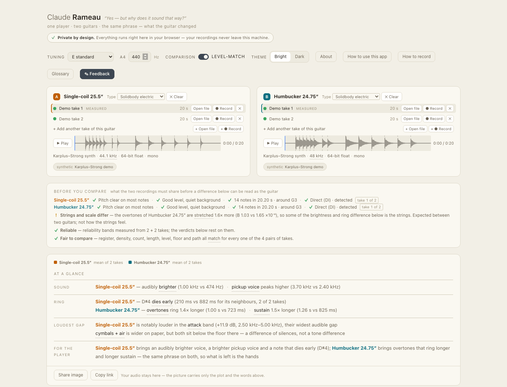
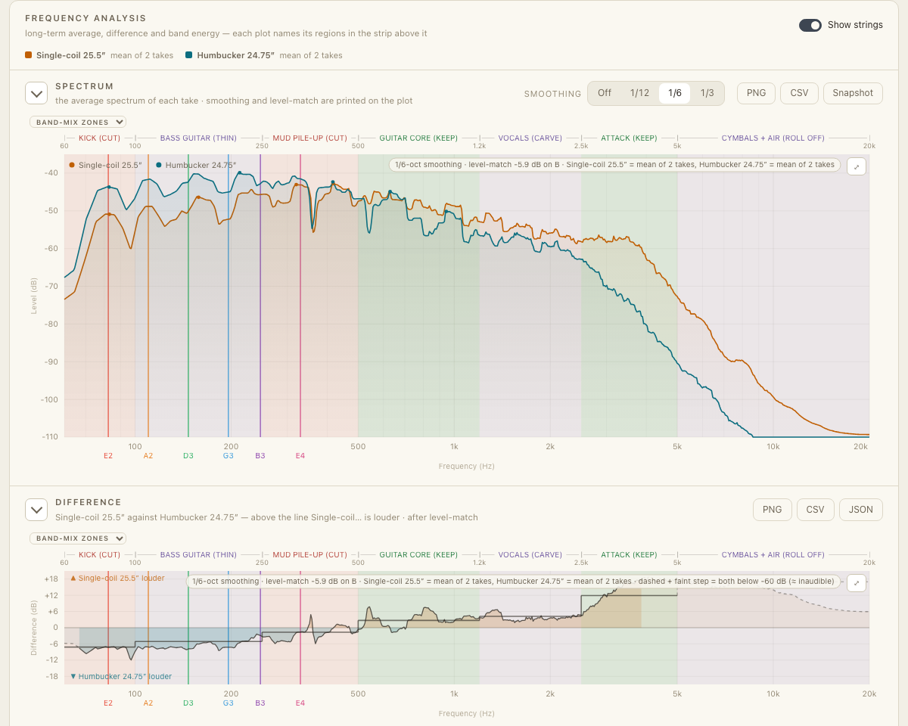
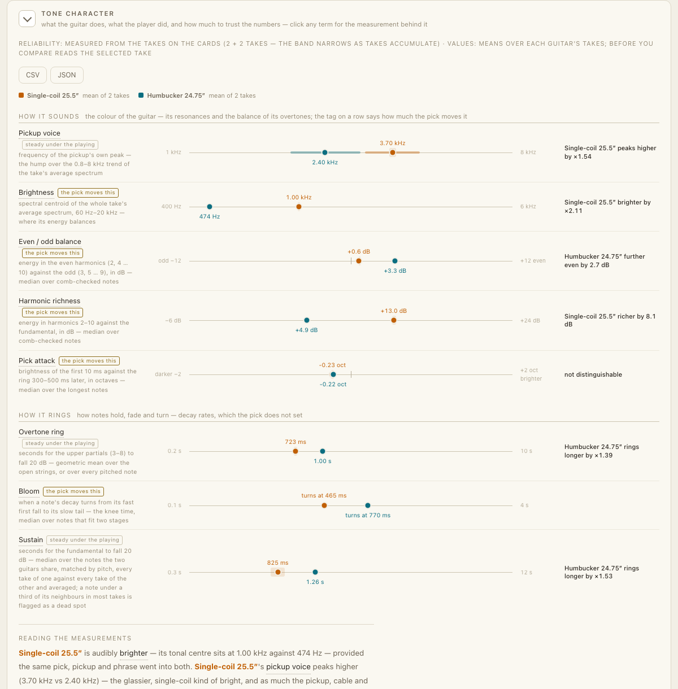
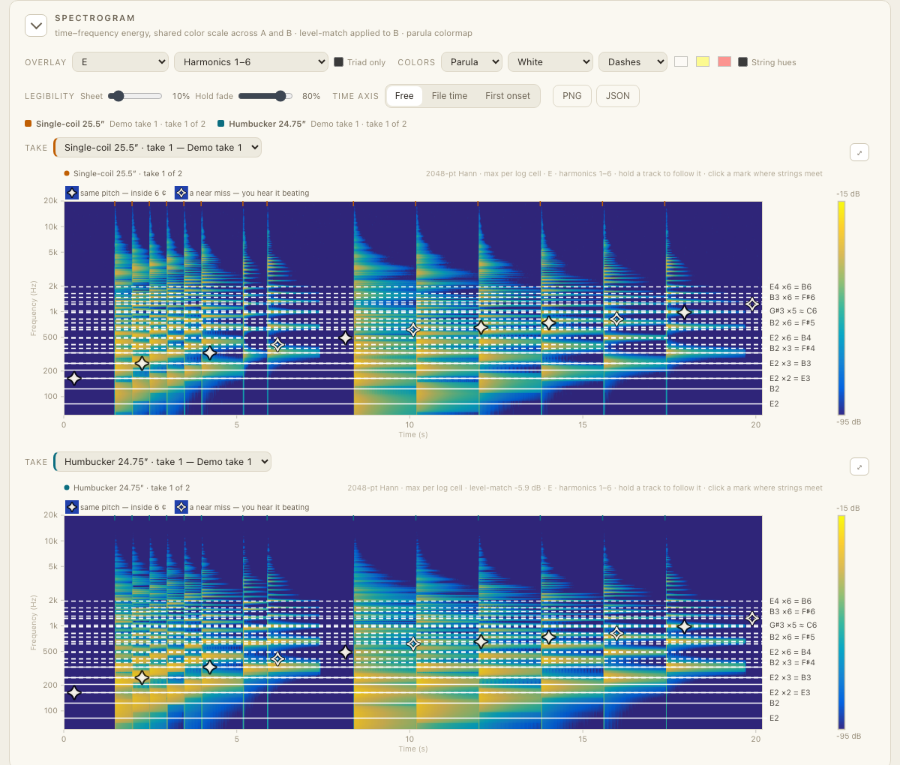
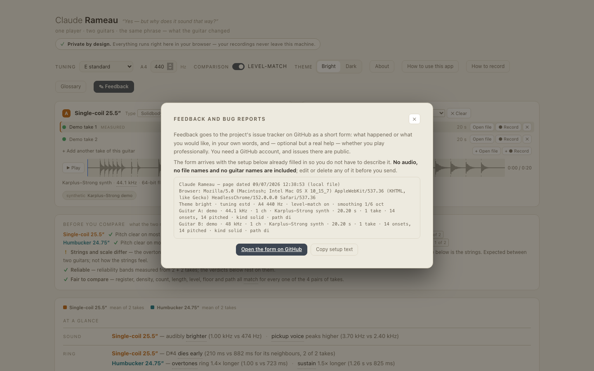
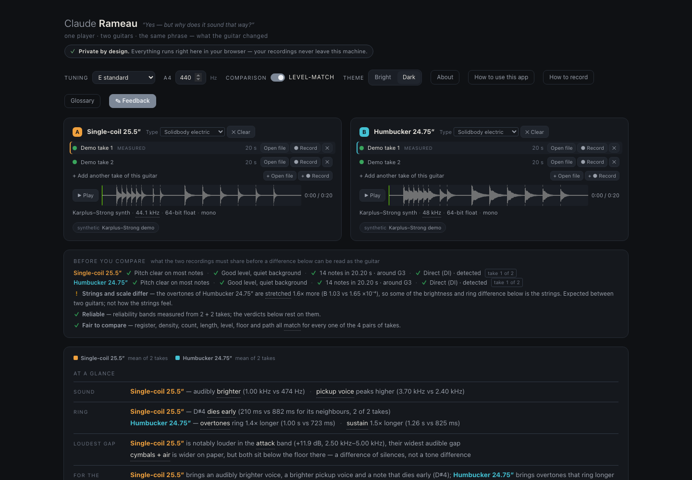

# Claude Rameau

> *"Yes — but why does it sound that way?"*

**Record the same riff on two guitars, drop the files in, and see why they sound different.**
Spectra, sustain, pickup voice, dead spots, overtone ring — measured, explained in a player's
words, and never uploaded: the whole app is one HTML file that runs in your browser.

**[Open Claude Rameau →](https://mdzahidh.github.io/rameau/)** · press **Load demo pair** to see it work before you record anything.

[](https://mdzahidh.github.io/rameau/)

## What you get

**One player, two guitars, the same phrase.** You record the same riff on two of your own
guitars — same picking, same amp, same cable, same room — and drop one recording on each
card. Because you and the phrase stay the same, what the plots show is the guitar.

- **Before you compare** ticks off what the two recordings share — register, note count,
  level, noise floor, recording path — whether the strings and scale differ, and whether the
  reliability bands are measured yet, so a difference below can be read as the guitar and not
  as the take.
- **At a glance** answers in sections, one line each: *Sound* (*Single-coil — audibly brighter
  (1.00 kHz vs 474 Hz) · pickup voice peaks higher (3.70 vs 2.40 kHz)*), *Ring* (*Humbucker —
  overtones ring 1.4× longer · sustain 1.5× longer*), the loudest gap, and what it adds up to
  for the player. Every item stands on a measured difference that cleared its own reliability
  band; the details sit one click away.
- **Spectrum and difference** — long-term average spectra with named regions, band energies,
  and a matched-EQ suggestion drawn on the face of a real device.
- **Spectrograms and envelopes** — with a harmonic overlay that predicts where each string's
  partials should land, and marks where two strings' harmonics collide.
- **Tone character** — pickup voice, body voice, overtone ring, bloom, sustain and dead spots,
  brightness, even/odd balance, pick attack — each with what it sounds like, what is measured,
  and how much the playing moves it. Click any value for the derivation with your numbers in it.
- **Takes** — record straight into a card or drop several files; every take counts, and the
  reliability bands narrow as takes accumulate.
- **Share** — a 1200×630 image of the comparison, or a PNG/CSV/JSON of any card.







## Private by design — nothing you drop in ever leaves your browser

**Your recordings are analysed right where they sit: in your own browser, on your own
machine.** Nothing is uploaded, and there is nothing to upload it to — no backend, no
API, no CDN, no fonts or scripts fetched from anywhere. The one exception is a visitor
counter (a Google tag) that loads only when you are online with Do Not Track off; it
never sees your audio, your files, or anything you type.

That's not a policy you have to take on trust. It's the architecture:

- **One file, no dependencies.** Read `index.html` and you have read the whole program.
- **Works with the network off.** Pull the plug, open it from `file://`, and everything
  — including the demo pair, which is synthesised in the page — still works.
- **Nothing is stored anywhere but your own browser.** Your tuning, theme and colour
  choices live in `localStorage`; exports (PNG, CSV, JSON) are written straight to your
  downloads folder.
- **Feedback leaves through your hands, not the page's.** The Feedback button opens a
  GitHub issue form in a new tab with your setup prefilled; you see every line before
  anything is sent, and audio is never part of it.

## Open it

Online: **https://mdzahidh.github.io/rameau/**

Offline: download `index.html` and open it —

```
open index.html
```

Any modern browser (Chrome, Safari, Firefox, Edge), straight off the filesystem. Nothing
to install.

## Use it

1. **Drop in your recordings.** One file onto guitar A, another onto guitar B — or press
   **● Record** and play straight into the card. WAV, AIFF, FLAC, MP3 or M4A. The sample
   rate is read from the file's own bytes, so there is nothing to configure. One file on
   its own is fine — you get the full single-guitar analysis, minus the comparison views.
2. **Name each guitar and set its kind** (solidbody, hollow body, acoustic) on its card.
   The kind selects what is measured — a solidbody's signature is its pickup hump, a hollow
   body's is its air resonance.
3. **Set the tuning you actually played.** The open-string axis and the anatomy regions
   derive from it.
4. **Add a second take of each guitar.** That is what tells the app how much a number moves
   on its own, and it starts to give verdicts from there.
5. **Leave Level-match on while comparing.** It cancels the broadband loudness gap
   between takes, so what you see is tone rather than output.

Then read down the page. Anything you don't recognise is clickable — labels, region
names, the dots on the plots — and opens what it measures with your numbers already
substituted into the formula.

**How you record matters more than anything in this app.** Change only the guitar:
same player, same part, same signal chain, same room, same gain staging. The in-app
*How to record* guide covers it, and the guided take walks you through six steps.

## Feedback and bug reports

Press **✎ Feedback** in the app, or open an issue directly:
**https://github.com/mdzahidh/rameau/issues/new?template=feedback.yml**

Tell us what happened or what you would like, in your own words. The form also asks —
optionally, and it helps us know who the app is serving — whether you play professionally.



## What it measures

- **Long-term average spectrum** — Welch, 8192-point Hann, 50 % overlap, resampled to a
  700-point log grid from 60 Hz to 20 kHz. Octave smoothing is selectable (off, 1/12,
  1/6, 1/3) and the active setting is always printed on the plot. A guitar with several
  takes is shown as the mean of its takes.
- **Band energies** over the region vocabulary you choose (band mix, EQ speak, guitar
  anatomy, solo EQ), with the boundaries drawn on the plot itself.
- **Spectrograms** — 2048-point Hann, 256 log-spaced cells, max-pooled per cell, on a
  shared colour scale so the two panes are directly comparable; zooming re-analyses the
  window at a finer resolution.
- **Envelopes**, aligned at each file's first detected onset.
- **EQ match** — a least-squares fit of standard analog band models against the smoothed
  difference curve, rendered on the face of a real device.
- **Tone character** — every row declares the evidence it needs and renders in one of four
  states (banded with a verdict, measured, partial, not measurable), with a reliability band
  measured from your own takes; harmonic numbers exist only for notes that pass a pitch comb
  check. The physics behind every row is in [docs/THEORY.md](docs/THEORY.md).

Levels are dB relative to a full-scale sine throughout. Analysis parameters are printed
in the page footer.



## Repository

| path | what it is |
|---|---|
| `index.html` | the entire application — the only shipped artifact |
| `tests/verify.sh` | the gate: five node suites, a headless-Chrome suite, tamper guards |
| `tests/*.test.js` | the suites; each extracts code from `index.html` and runs it under node |
| `tests/audit_tone.js` | the tone-panel audit on the three real takes in `samples/` |
| `samples/` | the demo pair and three real takes (Les Paul, SG, Majesty) |
| `SPEC.md` | the original commissioning prompt, verbatim, plus an append-only decision log |
| `docs/ARCHITECTURE.md` | DSP pipeline, parameter rationale, browser quirks, dead ends |
| `docs/THEORY.md` | the verified physics behind every measurement and every educational claim |
| `docs/STORY.md` | where the name and the app came from |
| `docs/ROADMAP.md` | what's being built next, in buildable pieces, and the rules for building them |
| `.github/ISSUE_TEMPLATE/` | the feedback form |
| `LICENSE` | MIT |

## Tests

```
./tests/verify.sh          # the whole gate, real Chrome included
./tests/verify.sh --node   # the node suites and tamper guards only, seconds
node tests/make_samples.js # regenerate the demo WAVs
```

No dependencies. Every suite reads `index.html` directly, so the tests always run against
the shipped code rather than a copy of it.

## Test hooks

Appending a query string drives the app for screenshots and manual checks:

| hook | effect |
|---|---|
| `?demo` | load the synthesised demo pair (`?demo=a` / `=b` for one side) |
| `?theme=bright\|dark` | force a theme |
| `?open=all` | unfold every collapsed panel — needed for full-page captures |
| `?strings=1` | show the open-string axis |
| `?sgchord=E` | overlay an open chord's harmonics on the spectrogram |
| `?vocab=eq\|anatomy\|solo\|mix\|none` | pick the region vocabulary |
| `?scrollto=<card id>` | scroll a card into view once the data has landed |
| `?feedback` | open the Feedback dialog |
| `?debug` | reveal the hidden demo-loading button and the `?load=` hook |

`CLAUDE.md` lists the rest, including the zoom, magnify and popover hooks.

## License

MIT — see [LICENSE](LICENSE).

## The name

Jean-Philippe Rameau derived harmony from the overtone series in 1722, insisting that
music theory was physics. His brother was named Claude — as is the AI this was built
with. The **About** panel in the app tells the rest of it, including why a question
about two guitars turned into this.
